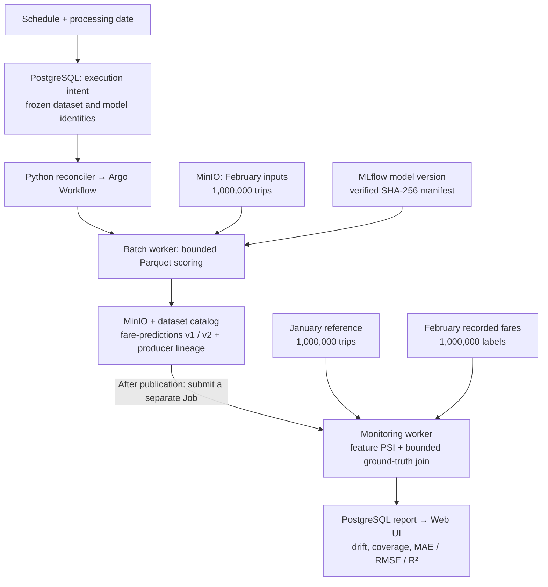
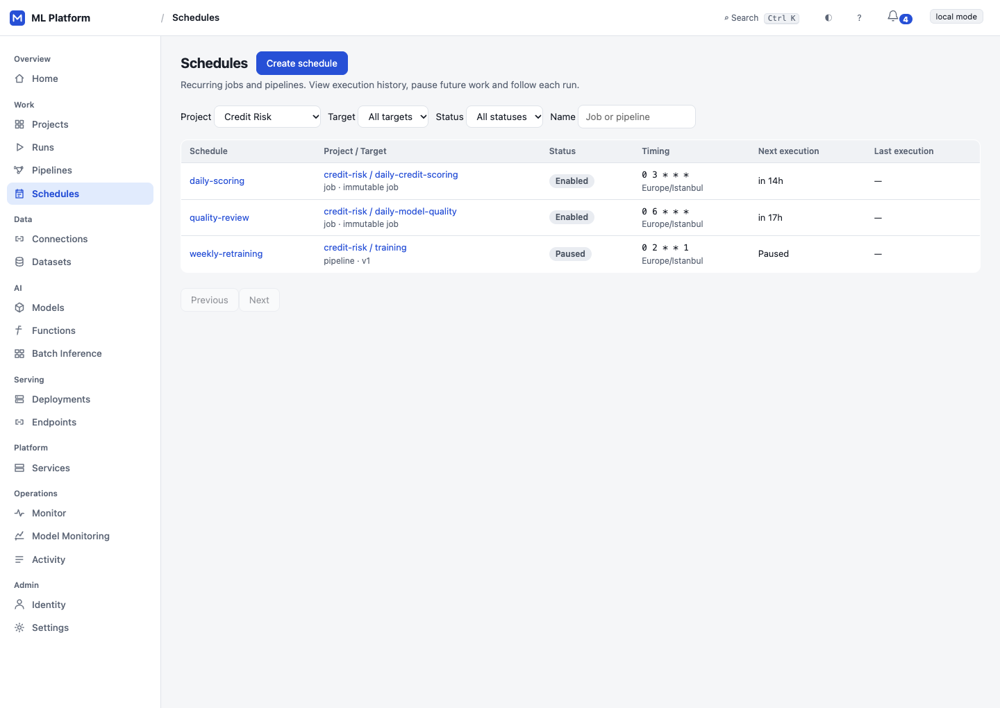
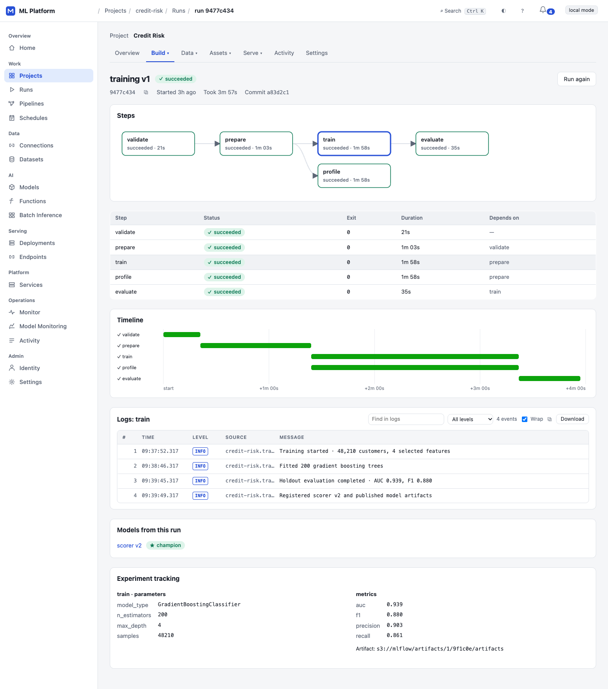
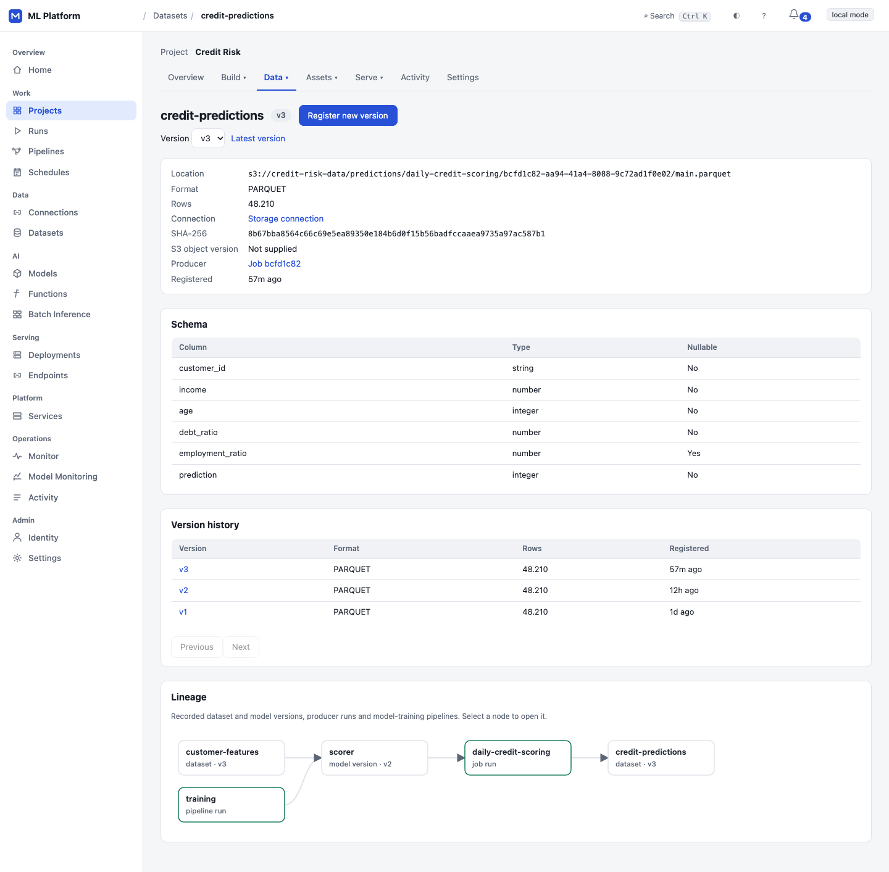
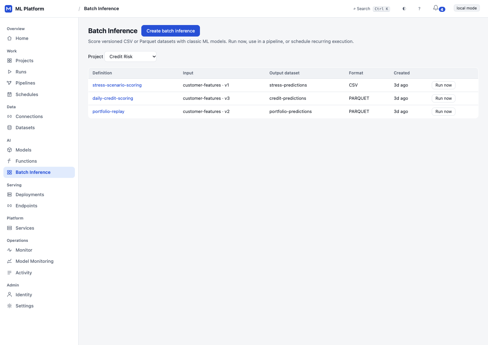
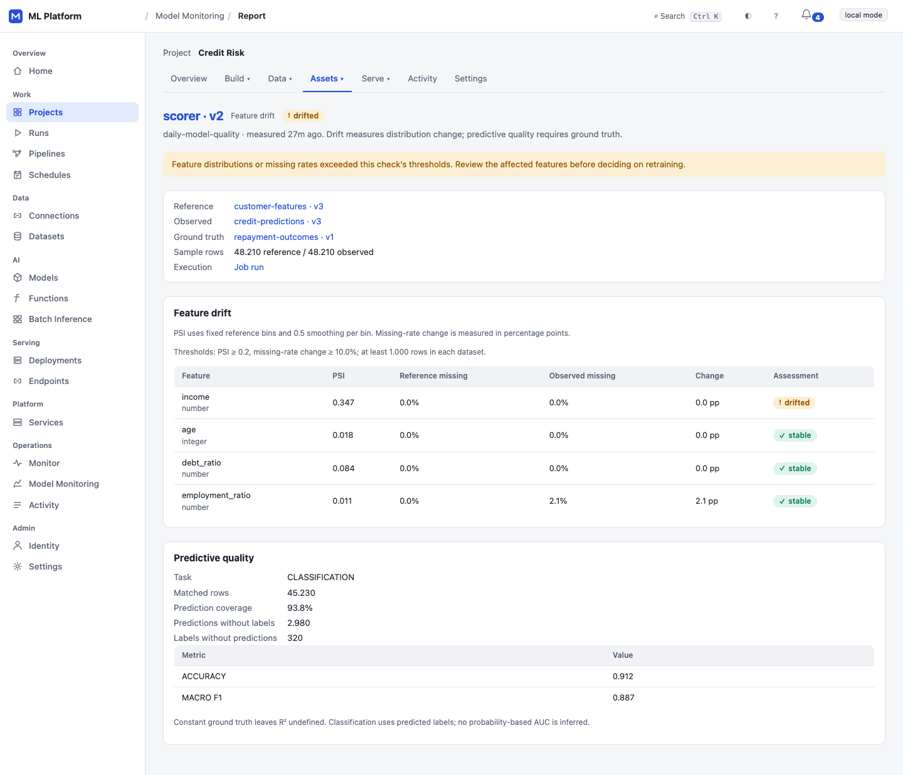

# ML Platform

A self-hosted platform for teams to train, ship and run machine learning models on
Kubernetes. Classic models, LLMs and your own functions alike: from a training run to a model behind a public,
rate-limited API, with a web UI, sign-in and project roles, canary releases and full
observability.


*Current UI, populated with synthetic demo data.*

## What it does

| | |
| --- | --- |
| **Projects and access** | Each project gets its own Kubernetes namespace and resource quota. Sign-in uses OpenID Connect, in the browser or with bearer tokens. Roles (`invoker`, `viewer`, `operator`, `admin`) are granted to users and groups; platform admins oversee everything. A fail-closed policy table decides who may call what. Every change is in an audit trail with the person's name |
| **Training** | Jobs and multi-step pipelines (DAGs) on Argo Workflows. Runs can be started, cancelled and retried. Each run shows its logs, a step timeline and why it failed. Lineage links a run to the model versions it produced |
| **Scheduling and parameters** | PostgreSQL-backed Job/Pipeline schedules with cron, timezone, pause/resume, concurrency and missed-run policies. Typed run parameters and immutable execution snapshots keep retries and scheduled runs traceable. [Scheduling](docs/scheduling.md) · [Run parameters](docs/run-parameters.md) |
| **Data management** | Project S3/MinIO connections use SecretRefs. CSV/Parquet datasets have immutable versions, schemas, integrity identities and recorded producer/model lineage. Typed forms, version history and a lineage graph expose these relationships. [Contract](docs/data-catalog.md) |
| **Batch inference** | Score a pinned dataset or resolve the latest/date-specific version at execution, verify a model manifest and publish versioned predictions. Bounded downloads, integrity checks and atomic output lineage share the existing Job/Pipeline lifecycle. [Contract](docs/batch-inference.md) |
| **Model Monitoring** | Compare pinned reference/observed data using PSI and missing-rate changes. Delayed ground truth adds MAE/RMSE/R² or label accuracy/macro F1, with matching coverage and unmatched counts. Reports link exact model/data/run identities; feature drift appears in the attention inbox. Dataset-triggered rules automate future publications with date-matched feedback and immutable execution snapshots. Online capture remains open. [Automation contract](docs/monitoring-automation.md) [Contract](docs/model-monitoring.md) |
| **Project secrets** | Admins create, rotate and delete project credentials in Settings. Values stay in Kubernetes Secrets; jobs and models use key and private-registry references. Read responses and audit records contain metadata only. See [project secrets](docs/secrets.md) |
| **Models** | Versions come from the MLflow registry, with lineage-scoped discovery after successful pipelines, or full-commit-pinned LLM versions from the Hugging Face Hub. Acceptance thresholds decide each version: evaluation makes it a candidate or rejects it, and promotion makes it the champion. Registry aliases are kept in sync |
| **Serving** | Immutable revisions. Canary rollouts shift traffic in steps and are gated on error rate, p95 latency and minimum traffic. A canary that fails its gates rolls back automatically, and any deployment can be rolled back by hand. Metrics and trends are kept per revision |
| **LLMs** | Language models run on GPUs with KServe's Hugging Face runtime (vLLM). Platform admins set each project's GPU quota, and every deploy and canary is checked against it. The API is OpenAI-compatible chat completions, with streaming. The UI has a chat playground and shows token usage per caller |
| **Functions** | The team's own container behind an endpoint: versions are images, scaled by Knative from zero to a maximum, called with any JSON at `POST …/invoke`. Same keys, limits, canaries and rollback as models |
| **Public API** | A separate gateway service opens endpoints to callers outside the platform. Each caller gets its own API key, shown once and stored hashed. Limits apply per endpoint and per key, counted in requests or, for LLMs, in tokens. Usage is reported by caller. Every response has a request id and the same error shape |
| **Platform Monitoring** | A Monitor page shows the platform's own health: reconciler heartbeats, the API, the gateway and the external systems it calls. Its thresholds are the same as the alerts. There is a Grafana dashboard, promtool-tested alerts, and traces that run from an API request through the background reconcilers |
| **Web UI** | Every area of the platform has a page, plus members and API access, in an app shell with a sidebar and project switcher. Charts follow a data-viz spec (validated colours, table twins, keyboard tooltips). Risky changes are previewed before they are made. Light, dark and mobile |

## Case study: scheduled scoring of one million real taxi trips

This scenario follows real data through scheduling, batch inference, output versioning
and model-quality reporting. It uses the public
[NYC TLC Yellow Taxi records](https://www.nyc.gov/site/tlc/about/tlc-trip-record-data.page)
for January and February 2025, with **one million cleaned, sampled journeys per month**.
The task is to predict the recorded fare in USD from distance, passenger count, pickup
hour and weekday.

January provides the reference distribution and 200,000 model-training rows; another
800,000 January rows are held out. February provides one million scoring inputs and a
separate ground-truth dataset. Preparation and model training run locally; the model
is registered in MLflow before the platform executes the scheduled scoring pipeline.



The schedule resolves business date `2025-02-01` to `taxi-features v2` and freezes that
version in the execution snapshot. The worker verifies the input checksum and model
manifest, scores in 10,000-row batches and publishes `fare-predictions v1`. A second
pipeline execution produces **v2 at a separate S3 location with identical bytes**;
replaying its creation key returns the same run. Catalog lineage links outputs to
the exact pipeline step, input dataset and model version.

The monitoring Job joins all **1,000,000 predictions** to recorded fares by unique
`trip_id`: **100% coverage, zero unmatched rows**. MAE is **2.082 USD**, RMSE **4.466 USD**
and R² **0.920**; independent pandas/sklearn calculations agree with the platform report.
All four selected features report **STABLE** at PSI threshold 0.2, with PSI values
between **0.000405 and 0.007974**.

| Local measurement | Scoring pipeline | Monitoring Job |
| --- | ---: | ---: |
| Platform-reported duration, including Argo lifecycle overhead | 18.95 s | 28.17 s |
| Main-container CPU / memory request and limit | 1 CPU / 1 GiB | 1 CPU / 1 GiB |
| Explicit ephemeral-storage reservation | 3 GiB | 5.5 GiB |
| Highest observed cgroup memory peak | 262.52 MiB | 276.96 MiB |
| Highest sampled `/tmp` usage | 16.98 MiB | 119.44 MiB |

These measurements come from a single-node local acceptance cluster with warm images.
Seven live samples at a nominal three-second interval cover main-container memory and
`/tmp`; they do not establish final absolute maxima. Disk reservations cover configured
worst-case byte bounds, rather than only this dataset's size. An initial 2-GiB memory
request waited for capacity; a new immutable 1-GiB definition completed successfully.

**Verified scope:** this is a scheduled replay of historical data, with monitoring
initially submitted separately. The follow-up run verified dataset-triggered automation:
output version 3 automatically produced a STABLE report with 1,000,000 matched labels
and no duplicate execution after reconciler restart. Ground truth was withheld before
scoring, rather than collected from live traffic. Same-DAG output binding, rolling
monitoring windows and production capacity remain open.
[Automation evidence](docs/evidence/live-2026-10-08/monitoring-automation/README.md).
STABLE describes the selected features in these cleaned windows, not every possible
model-quality issue. The schedule is paused after the demonstration, while datasets,
output versions and the report remain available in the UI.

[Full scenario, data preparation and execution identities](docs/evidence/live-2026-10-08/million-row-acceptance/README.md)
· [Artifact hashes](docs/evidence/live-2026-10-08/million-row-acceptance/ARTIFACTS.sha256)
· [Batch and monitoring contracts](docs/batch-inference.md)

## UI tour

Screenshots below show the current navigation and a synthetic Credit Risk scenario:
48,210 customer records, a pinned scorer, versioned predictions and delayed repayment
labels. They illustrate product behavior, not production throughput measurements.

<details>
<summary><strong>Projects and project overview</strong> — shared navigation, resource inventory and active work</summary>


</details>

<details>
<summary><strong>Schedules and pipeline runs</strong> — recurring work, pinned targets and readable execution logs</summary>





</details>

<details>
<summary><strong>Data lineage and batch inference</strong> — dataset versions, schemas and prediction outputs</summary>





</details>

<details open>
<summary><strong>Model Monitoring</strong> — feature drift, feedback coverage and predictive quality</summary>



</details>

## Architecture

```
 people (browser)               services and partners (API keys, OAuth)
        │                                    │
        ▼                                    ▼
 ┌──────────────┐   OIDC   ┌──────────────────────────┐
 │  Web UI      │◀───────▶│  Identity provider       │  e.g. Keycloak
 │  (React)     │          │  users and groups        │
 └──────┬───────┘          └──────────────────────────┘
        │ same origin, session cookie
        ▼
 ┌──────────────────────────────┐      ┌─────────────────────────────────────┐
 │  Control plane API           │      │  Inference gateway (own pods)       │
 │  projects · roles · jobs     │      │  POST /v1/{project}/{endpoint}/     │
 │  pipelines · models · evals  │      │  predict | chat/completions | invoke│
 │  deployments · canaries      │      │  API keys · limits · streaming      │
 │  API keys · GPU quota · audit│      │  usage metering                     │
 └──────┬───────────────────────┘      └──────┬──────────────────────────────┘
        │ desired state                       │ endpoints and keys (cached 5 s)
        ▼                                     ▼
 ┌───────────────────────────────────────────────────┐
 │  PostgreSQL: the single source of lifecycle truth │
 └──────┬────────────────────────────────────────────┘
        │ reconcile loop: idempotent, audited, traced
        ▼
 ┌────────────────┬────────────────┬──────────────────┬────────────────────────┐
 │ Kubernetes     │ Argo Workflows │ MLflow           │ KServe (Knative)       │
 │ namespace per  │ jobs and       │ runs, metrics,   │ MLflow server, vLLM on │
 │ project,       │ pipeline DAGs  │ model registry   │ GPUs, or a function's  │
 │ quotas, GPUs   │                │                  │ container; canaries    │
 └────────────────┴────────────────┴──────────────────┴────────────────────────┘
   everything → OpenTelemetry Collector → Prometheus · Tempo · Grafana · alerts
```

* **The database holds intent; reconcilers make it real.** Requests write desired state to
  PostgreSQL and return. Reconcilers drive Kubernetes, Argo, MLflow and KServe toward it and
  report back. A crash anywhere is recovered by the next pass.
* **Hexagonal.** Domain and application code know no frameworks. Every external system sits
  behind a port, with an adapter and an in-memory fake, and an architecture test enforces
  the boundaries.
* **The gateway is the data plane.** Prediction traffic never goes through the management
  API, and it scales on its own.
* **The UI talks only to the platform API.** It never calls MLflow, Argo or KServe directly.

## Getting started

```bash
make cp-demo        # the whole platform on in-memory fakes: http://localhost:8080/ui
                    # (prints a ready-to-run curl for the public gateway)
make cp-test        # unit, API, PostgreSQL and real-browser tests
make cp-check-light # lint/types + memory tests; no PostgreSQL, browser or cluster startup
make gateway-e2e    # real PostgreSQL + the real gateway process + a model server over HTTP
make identity-up    # Keycloak with demo users (alice, bob, carol) for real sign-in
```

The demo includes these workspaces:

* **Credit Risk:** pipelines, a champion model, and a live canary.
* **Customer Support:** an LLM assistant from the Hugging Face Hub, public with an API key.
* **Fraud Detection:** an empty project, to start from.
* **Churn Prediction:** a workspace being provisioned.

Call a model from outside:

```bash
curl https://api.example.com/v1/credit-risk/credit-risk-prod/predict \
  -H "Authorization: Bearer $MLP_API_KEY" -d '{"instances": [[0.42, 1200, 3, 0.18]]}'
```

Call an LLM, with any OpenAI client:

```python
from openai import OpenAI

client = OpenAI(base_url="https://api.example.com/v1/customer-support/assistant-prod",
                api_key=os.environ["MLP_API_KEY"])
reply = client.chat.completions.create(model="assistant-prod",
                                       messages=[{"role": "user", "content": "Hello"}])
```

## Running on a cluster

| Component | How |
| --- | --- |
| Local cluster | `make local-up`: kind, Argo CD (GitOps), MLflow, PostgreSQL, MinIO, Prometheus, Grafana |
| Database | `make cp-migrate`: Alembic migrations |
| Scheduling | PostgreSQL-backed Job/Pipeline schedules, queued intents, concurrency, timezone/DST and execution history ([contract](docs/scheduling.md)) |
| Control plane | `docker/controlplane/Dockerfile` and `helm/controlplane`: API, reconciler, gateway, migration Job, RBAC and fail-closed admission policies (Kubernetes 1.30+); deployed and runtime-verified on the ARM64 lab ([installation](docs/installation.md)) |
| Gateway | Go runtime in `services/gateway-go`, a separate image and a Python rollback option in the control-plane chart; Python standalone fallback at `k8s/gateway/gateway.yaml` has Ingress/TLS and a topology-specific NetworkPolicy ([networking](docs/networking.md)) |
| Identity | `k8s/identity/` (Keycloak), configured with `CP_OIDC_*` settings |
| Observability | `make observability-up`: Collector, Tempo, dashboards and alerts; API HTTP/HTTPX + Go gateway server/upstream + reconciler SQL traces, DB pool/query metrics, control-plane resource panels and operator PostgreSQL profiling ([scope and verification](docs/observability.md#bottleneck-instrumentation-2026-10-07)) |
| Local storage | Native kubelet GC collects six-hour-unused images; container logs rotate at 10Mi with three files. `make kind-storage-status` / `kind-storage-apply` inspect or configure existing nodes ([scope and host disk limits](docs/local-storage.md)) |
| Benchmark client | Go [`mlp-loadgen`](tools/loadgen/README.md): open-loop load, visible queue/drop/scheduling delay, per-target results and streaming timings; cluster parity gate pending |
| AWS | Legacy infrastructure lab in `infra/terraform`; current control-plane AWS deployment remains pending |

Settings are environment variables prefixed `CP_` (`controlplane/settings.py`).

## Live verification

Recorded on **Kubernetes 1.32.0, single-node ARM64 kind** (`kind-mlp-acceptance`),
2026-10-06–07. The full seven-phase CPU lifecycle passed, alongside separate failure and
isolation drills:

- ✓ Argo training → MLflow registration/discovery/evaluation
- ✓ KServe serving → real gateway inference
- ✓ Healthy canary: 10% → 100%
- ✓ Candidate-only failure → automatic rollback
- ✓ Scale-to-zero → reactivation
- ✓ Secret rotation / forced-delete startup failure and recovery
- ✓ Scoped storage-account cleanup, preserving foreign accounts
- ✓ Updated serving/S3 initializer: zero fixable HIGH/CRITICAL findings and SPDX SBOMs
- ✓ Same-revision serving drift repair with a new matching immutable backend
- ✓ Project RBAC / restricted PSA / installed admission policies (server dry runs)
- ✓ Cross-project ingress isolation on an enforcing network-policy engine
- ✓ Reconciler Lease failover + PDB
- ✓ API/gateway rolling restart: 200/200 probes
- ✓ Shared PostgreSQL limiter correctness across 1/2/4 gateway replicas
- ✓ 500 offered RPS admission/rejection load with two/four gateway replicas
- ✓ Basic PostgreSQL outage → fail-closed 503 → recovery, with warm and expired caches

[Live reports and artifact scopes](docs/evidence/live-2026-10-06/README.md) record both
passes and failed attempts. Lab auth was `none`; later acceptance images were built
from working trees and do not inherit the earlier clean control-plane release scan.
The [serving image remediation](docs/serving-image-security.md) records the explicit
MLServer compatibility fork and standalone storage library.
Separate local evidence covers PostgreSQL tests, Chromium, Prometheus queries,
Keycloak sign-in, promtool and kubeconform; it does not establish in-cluster OIDC.

**Data and automation follow-up (2026-10-08):** local acceptance covers
[scheduling](docs/evidence/live-2026-10-08/scheduling/README.md),
[typed run parameters](docs/evidence/live-2026-10-08/run-parameters/README.md),
[managed batch inference](docs/evidence/live-2026-10-08/batch-inference/README.md),
[data management UI](docs/evidence/live-2026-10-08/data-management-ui/README.md) and
[Model Monitoring core](docs/evidence/live-2026-10-08/model-monitoring/README.md).
The [batch hardening release](docs/evidence/live-2026-10-08/batch-hardening/README.md)
passed 929 backend tests, 24 Linux worker tests and all 12 control-plane image gates.
A separate [NYC taxi scenario](docs/evidence/live-2026-10-08/million-row-acceptance/README.md)
uses one million real trips for scheduled scoring, versioned output, ground-truth
matching and drift/performance reports. These local checks do not establish production
capacity or online capture.

**PostgreSQL limiter load follow-up:** an in-cluster aiohttp/uvloop generator and
isolated OTLP histograms now separate limiter, HTTP and client queue latency. At
500 offered RPS, two/four gateways completed approximately **493/495 RPS** with correct
shared budgets, no 5xx/transport errors and no client backlog.

| Gateway replicas | Limiter p95, before → after | HTTP request p95, before → after |
| --- | --- | --- |
| 2 | 96 → 30 ms | 519 → 161 ms |
| 4 | 187 → 4.7 ms | 516 → 4.0 ms |

The two-bucket PostgreSQL transaction uses three SQL statements instead of nine.
The generator also fixed a significant client-side bottleneck. These are ten-second,
600-units/minute admission/rejection tests; they do not prove 500 successful inference
requests per second or a production capacity ceiling. A single gateway still develops
a queue, including in the 2 CPU probe. See the [full report and limitations](docs/limiter-performance.md)
and [raw comparison](docs/evidence/live-2026-10-07/limiter/summary.json).

**Observability / Go loadgen follow-up:** real Collector/Tempo now receives native API
and gateway HTTP/SQL/outbound traces, reconciler SQL spans and application bottleneck
metrics. A paired Python/Go 500 offered RPS run completed all 30,000 requests with valid
shared budgets; both clients reached approximately 500 RPS at 2/4 gateway pods. One pod
still queues, and resource dashboard sources remain missing in this lab.
[Results, CPU/RSS and limitations](docs/evidence/live-2026-10-07/observability/README.md).
A subsequent [Go-driven worker experiment](docs/evidence/live-2026-10-07/observability/worker-experiment.md)
found that doubling Python gateway workers introduced DB-pool 503s; enlarging the pool
removed those errors without improving throughput. An
[unprofiled OTel on/off comparison](docs/evidence/live-2026-10-07/observability/gateway-otel-ab.md)
found 60% lower pod CPU/request with the SDK disabled on rejection-only traffic;
a subsequent [higher-load probe](docs/evidence/live-2026-10-07/observability/gateway-otel-off-capacity.md)
observed a 600–700 RPS plateau with the SDK disabled on one CPU. These are short
rejection-only tests. The subsequent
[enabled hot-path profile](docs/evidence/live-2026-10-07/observability/gateway-hotpath-ab.md)
retains counters, HTTP traces and custom DB/limiter metrics: normal repeats reached
492–500 RPS with 43.8% lower timed CPU than full instrumentation. Normal/diagnostic
profiles are implemented; installed deployments retain their earlier image/settings.
Two subsequent [five-minute normal-profile soaks](docs/evidence/live-2026-10-07/observability/gateway-normal-soak.md)
maintained approximately 500 RPS at 0.53–0.56 mean CPU core across regular exports.
Both zero-error gates failed: 299,997/300,000 attempts returned 429, with three transport
failures (two identified as connection resets). Memory/threads stayed stable in these
windows. The subsequent [connection A/B/C](docs/evidence/live-2026-10-07/observability/gateway-connection-ab.md)
reproduced a reset at the server keep-alive boundary; client idle timeout 2 seconds
passed 150,000/150,000 rejection requests at 500 RPS with zero errors/drops and 0.60 core.
Keep-alive off failed at 472 RPS with errors/drops and 0.98 core. These are rejection-only
results; successful inference capacity remains open.

**Go gateway comparison:** an isolated [PoC](docs/evidence/live-2026-10-07/observability/gateway-runtime-ab.md)
with normal OTel and the B transport used 70.7% less CPU/request at 500 rejection RPS
(0.62 → 0.18 core; p95 251 → 1.48 ms). Go also completed 1,000/1,500 offered RPS with
zero errors/drops at 0.33/0.48 core; Python overloaded at 554/518 completed RPS. Real
function forwarding and shared PostgreSQL/trace checks passed. These are 60-second
rejection windows, not successful inference capacity.

**Go gateway migration:** the chart now defaults to a separate, source-built Go image;
API/reconciler/migrations remain Python, with the Python gateway retained for rollback.
OIDC/project roles, LLM reservation/settlement and per-read streaming deadlines are
implemented/tested. Clean HIGH/CRITICAL scan, SBOM, a five-minute 500 RPS normal-OTel
soak, real function rolling probes and DB outage/recovery are recorded in the
[migration report](docs/evidence/live-2026-10-07/observability/gateway-go-migration.md). The subsequent
[concurrency follow-up](docs/evidence/live-2026-10-07/observability/gateway-concurrency-followup.md)
removes auth/cache lock contention and sets a configurable 60-second server idle timeout.
Its scanned source image is installed on two lab replicas; 200/200 real function calls
passed during rollout, followed by connection reuse after 5.2 seconds idle.

Real identity-provider/GPU and successful-upstream capacity gates remain open.

**Still open:**

- Longer successful-inference load, final-image capacity rerun and sustained DB outage/thread growth
- Final clean release artifact/target-architecture rerun
- OIDC in-cluster acceptance
- Strict egress / multi-node loss and drain / hung-leader drills
- Private-registry pulls/credential rotation and cleanup conflict/outage retry
- Backup/restore disaster recovery
- GPU/vLLM/immutable and gated Hugging Face downloads
- Real ingress/TLS and AWS deployment

Current closure status: [docs/status.md](docs/status.md). Procedures and next steps:
[verification checklist](docs/local-verification.md) and [roadmap](docs/roadmap.md).

## Documentation

* [Current status and recorded verification](docs/status.md)
* [Live acceptance evidence](docs/evidence/live-2026-10-06/README.md)
* [Roadmap: what is missing and what comes next](docs/roadmap.md)
* [Security hardening and remaining tests](docs/security-hardening.md)
* [Identity and roles](docs/identity.md)
* [Gateway and API keys](docs/gateway.md)
* [Web UI design](docs/ui.md)
* [Observability](docs/observability.md)
* [Go adoption and performance gates](docs/go-runtime-plan.md)
* [Architecture](docs/architecture.md)
* [Failure drills on the first infrastructure](docs/history/failure-engineering.md)
* [SLOs measured on the first inference service](docs/history/slo.md)
* [AWS design for the first infrastructure](docs/history/aws-architecture.md)
* [Cost model for the first infrastructure](docs/history/cost-model.md)
* [What to verify on a real cluster](docs/local-verification.md)

## Security

* **Committed credentials:** only disposable local-development defaults.
* **API keys:** stored hashed and shown once.
* **Sessions:** HttpOnly signed cookies, with CSRF protection.
* **Workloads:** project namespaces enforce Pod Security `restricted`; serving has no Kubernetes token/RBAC. Project RBAC, PSA, installed admission policies and enforcing cross-project ingress isolation passed in the lab. Production requires site-configured NetworkPolicies; strict egress and broader topology checks remain open ([security hardening](docs/security-hardening.md)).

## License

[MIT](LICENSE)

Control-plane operational contracts: [readiness, lifecycle and budgets](docs/operations.md),
[network topology](docs/networking.md), and [backup/restore](docs/recovery.md).

Current remediation and remaining live gates are tracked in [docs/roadmap.md](docs/roadmap.md).
Production gateway limits share PostgreSQL capacity; LLM GPU reservations include maximum
replicas and transition/canary overlap. Job/model forms select project secret names/keys,
and Settings shows their usage. See [installation preparation](docs/installation.md) for
pinned, checksum-verified bootstrap bundles and manual-sync GitOps. Run `make cp-check-light`
for checks without PostgreSQL/browser startup, or `make cp-http-test` for native gateway
streaming tests.

Security/HA includes namespace-scoped API Secret and workload-read RBAC, API/gateway PDBs
and two replicas, Lease-elected reconcilers with a PDB/watchdog, migration ownership locks
and a production policy profile. Manual image, load/outage, recovery and CPU lifecycle
procedures are in [docs/acceptance.md](docs/acceptance.md); recorded results and open
scopes are listed in Live verification above.
