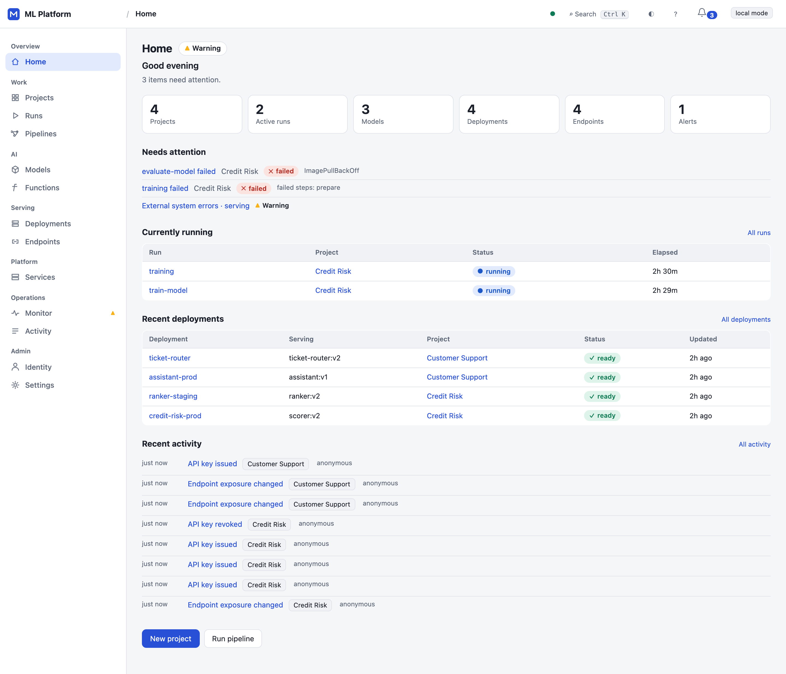
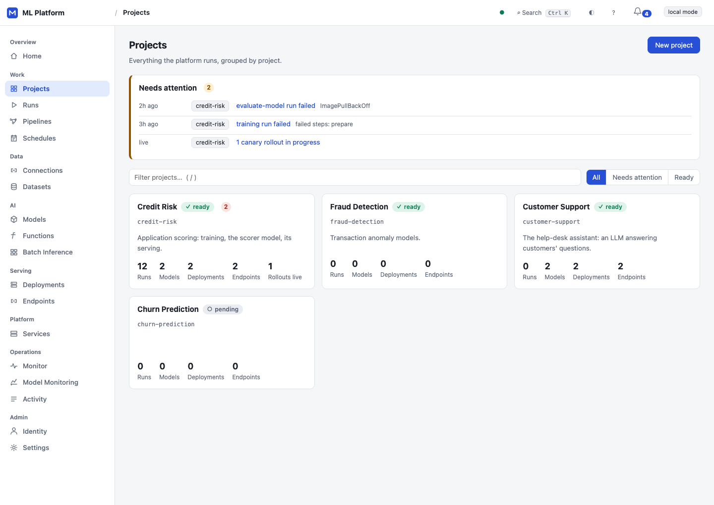
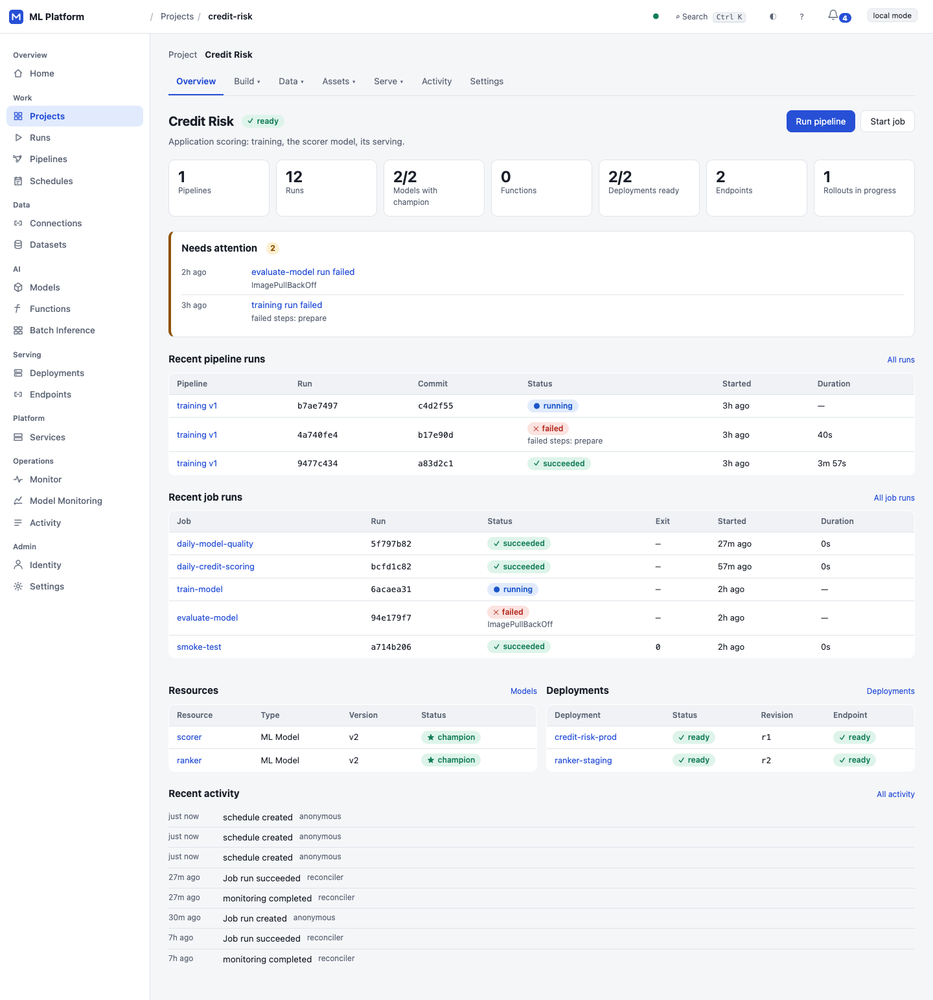

# ML Platform

**Home — platform overview**



**Projects — choose a workspace**



**Project Overview — Credit Risk**



A self-hosted platform for teams to train, ship and run machine learning models on
Kubernetes. Classic models, LLMs and your own functions alike: from a training run to a model behind a public,
rate-limited API, with a web UI, sign-in and project roles, canary releases and full
observability.

## What it does

| | |
| --- | --- |
| **Projects and access** | Each project gets its own Kubernetes namespace and resource quota. Sign-in uses OpenID Connect, in the browser or with bearer tokens. Roles (`invoker`, `viewer`, `operator`, `admin`) are granted to users and groups; platform admins oversee everything. A fail-closed policy table decides who may call what. Every change is in an audit trail with the person's name |
| **Training** | Jobs and multi-step pipelines (DAGs) on Argo Workflows. Runs can be started, cancelled and retried. Each run shows its logs, a step timeline and why it failed. Lineage links a run to the model versions it produced |
| **Project secrets** | Admins create, rotate and delete project credentials in Settings. Values stay in Kubernetes Secrets; jobs and models use key and private-registry references. Read responses and audit records contain metadata only. See [project secrets](docs/secrets.md) |
| **Models** | Versions come from the MLflow registry, with lineage-scoped discovery after successful pipelines, or full-commit-pinned LLM versions from the Hugging Face Hub. Acceptance thresholds decide each version: evaluation makes it a candidate or rejects it, and promotion makes it the champion. Registry aliases are kept in sync |
| **Serving** | Immutable revisions. Canary rollouts shift traffic in steps and are gated on error rate, p95 latency and minimum traffic. A canary that fails its gates rolls back automatically, and any deployment can be rolled back by hand. Metrics and trends are kept per revision |
| **LLMs** | Language models run on GPUs with KServe's Hugging Face runtime (vLLM). Platform admins set each project's GPU quota, and every deploy and canary is checked against it. The API is OpenAI-compatible chat completions, with streaming. The UI has a chat playground and shows token usage per caller |
| **Functions** | The team's own container behind an endpoint: versions are images, scaled by Knative from zero to a maximum, called with any JSON at `POST …/invoke`. Same keys, limits, canaries and rollback as models |
| **Public API** | A separate gateway service opens endpoints to callers outside the platform. Each caller gets its own API key, shown once and stored hashed. Limits apply per endpoint and per key, counted in requests or, for LLMs, in tokens. Usage is reported by caller. Every response has a request id and the same error shape |
| **Monitoring** | A Monitor page shows the platform's own health: reconciler heartbeats, the API, the gateway and the external systems it calls. Its thresholds are the same as the alerts. There is a Grafana dashboard, promtool-tested alerts, and traces that run from an API request through the background reconcilers |
| **Web UI** | Every area of the platform has a page, plus members and API access, in an app shell with a sidebar and project switcher. Charts follow a data-viz spec (validated colours, table twins, keyboard tooltips). Risky changes are previewed before they are made. Light, dark and mobile |

## Architecture

```
 people (browser)               services and partners (API keys, OAuth)
        │                                    │
        ▼                                    ▼
 ┌──────────────┐   OIDC   ┌──────────────────────────┐
 │  Web UI      │◀───────▶│  Identity provider       │  e.g. Keycloak
 │  (React)     │          │  users and groups        │
 └──────┬───────┘          └──────────────────────────┘
        │ same origin, session cookie
        ▼
 ┌──────────────────────────────┐      ┌─────────────────────────────────────┐
 │  Control plane API           │      │  Inference gateway (own pods)       │
 │  projects · roles · jobs     │      │  POST /v1/{project}/{endpoint}/     │
 │  pipelines · models · evals  │      │  predict | chat/completions | invoke│
 │  deployments · canaries      │      │  API keys · limits · streaming      │
 │  API keys · GPU quota · audit│      │  usage metering                     │
 └──────┬───────────────────────┘      └──────┬──────────────────────────────┘
        │ desired state                       │ endpoints and keys (cached 5 s)
        ▼                                     ▼
 ┌───────────────────────────────────────────────────┐
 │  PostgreSQL: the single source of lifecycle truth │
 └──────┬────────────────────────────────────────────┘
        │ reconcile loop: idempotent, audited, traced
        ▼
 ┌────────────────┬────────────────┬──────────────────┬────────────────────────┐
 │ Kubernetes     │ Argo Workflows │ MLflow           │ KServe (Knative)       │
 │ namespace per  │ jobs and       │ runs, metrics,   │ MLflow server, vLLM on │
 │ project,       │ pipeline DAGs  │ model registry   │ GPUs, or a function's  │
 │ quotas, GPUs   │                │                  │ container; canaries    │
 └────────────────┴────────────────┴──────────────────┴────────────────────────┘
   everything → OpenTelemetry Collector → Prometheus · Tempo · Grafana · alerts
```

* **The database holds intent; reconcilers make it real.** Requests write desired state to
  PostgreSQL and return. Reconcilers drive Kubernetes, Argo, MLflow and KServe toward it and
  report back. A crash anywhere is recovered by the next pass.
* **Hexagonal.** Domain and application code know no frameworks. Every external system sits
  behind a port, with an adapter and an in-memory fake, and an architecture test enforces
  the boundaries.
* **The gateway is the data plane.** Prediction traffic never goes through the management
  API, and it scales on its own.
* **The UI talks only to the platform API.** It never calls MLflow, Argo or KServe directly.

## Getting started

```bash
make cp-demo        # the whole platform on in-memory fakes: http://localhost:8080/ui
                    # (prints a ready-to-run curl for the public gateway)
make cp-test        # unit, API, PostgreSQL and real-browser tests
make cp-check-light # lint/types + memory tests; no PostgreSQL, browser or cluster startup
make gateway-e2e    # real PostgreSQL + the real gateway process + a model server over HTTP
make identity-up    # Keycloak with demo users (alice, bob, carol) for real sign-in
```

The demo has three projects with history:
* **Credit Risk:** pipelines, a champion model, and a live canary.
* **Customer Support:** an LLM assistant from the Hugging Face Hub, public with an API key.
* **Fraud Detection:** an empty project, to start from.

Call a model from outside:

```bash
curl https://api.example.com/v1/credit-risk/credit-risk-prod/predict \
  -H "Authorization: Bearer $MLP_API_KEY" -d '{"instances": [[0.42, 1200, 3, 0.18]]}'
```

Call an LLM, with any OpenAI client:

```python
from openai import OpenAI

client = OpenAI(base_url="https://api.example.com/v1/customer-support/assistant-prod",
                api_key=os.environ["MLP_API_KEY"])
reply = client.chat.completions.create(model="assistant-prod",
                                       messages=[{"role": "user", "content": "Hello"}])
```

## Running on a cluster

| Component | How |
| --- | --- |
| Local cluster | `make local-up`: kind, Argo CD (GitOps), MLflow, PostgreSQL, MinIO, Prometheus, Grafana |
| Database | `make cp-migrate`: Alembic migrations |
| Control plane | `docker/controlplane/Dockerfile` and `helm/controlplane`: API, reconciler, gateway, migration Job, RBAC and fail-closed admission policies (Kubernetes 1.30+); deployed and runtime-verified on the ARM64 lab ([installation](docs/installation.md)) |
| Gateway | Included in the control-plane chart; standalone example at `k8s/gateway/gateway.yaml` has Ingress/TLS and a topology-specific NetworkPolicy ([networking](docs/networking.md)) |
| Identity | `k8s/identity/` (Keycloak), configured with `CP_OIDC_*` settings |
| Observability | `make observability-up`: OpenTelemetry Collector, Tempo, dashboards, alerts |
| AWS | Legacy infrastructure lab in `infra/terraform`; current control-plane AWS deployment remains pending |

Settings are environment variables prefixed `CP_` (`controlplane/settings.py`).

## Live verification

Recorded on **Kubernetes 1.32.0, single-node ARM64 kind** (`kind-mlp-acceptance`),
2026-10-06. The full seven-phase CPU lifecycle passed, alongside separate failure and
isolation drills:

- ✓ Argo training → MLflow registration/discovery/evaluation
- ✓ KServe serving → real gateway inference
- ✓ Healthy canary: 10% → 100%
- ✓ Candidate-only failure → automatic rollback
- ✓ Scale-to-zero → reactivation
- ✓ Secret rotation / forced-delete startup failure and recovery
- ✓ Scoped storage-account cleanup, preserving foreign accounts
- ✓ Same-revision serving drift repair with a new matching immutable backend
- ✓ Project RBAC / restricted PSA / installed admission policies (server dry runs)
- ✓ Cross-project ingress isolation on an enforcing network-policy engine
- ✓ Reconciler Lease failover + PDB
- ✓ API/gateway rolling restart: 200/200 probes
- ✓ Shared PostgreSQL limiter correctness across 1/2/4 gateway replicas
- ✓ Basic PostgreSQL outage → fail-closed 503 → recovery, with warm and expired caches

[Live reports and artifact scopes](docs/evidence/live-2026-10-06/README.md) record both
passes and failed attempts. Lab auth was `none`; later acceptance images were built
from working trees and do not inherit the earlier clean control-plane release scan.
Separate local evidence covers PostgreSQL tests, Chromium, Prometheus queries,
Keycloak sign-in, promtool and kubeconform; it does not establish in-cluster OIDC.

**Still open:**

- Five fixable HIGH findings: four in serving, one in the initializer image
- 500 RPS limiter availability/performance (failed), isolated limiter latency and sustained outage/thread growth
- Final clean release artifact/target-architecture rerun
- OIDC in-cluster acceptance
- Strict egress / multi-node loss and drain / hung-leader drills
- Private-registry pulls/credential rotation and cleanup conflict/outage retry
- Backup/restore disaster recovery
- GPU/vLLM/immutable and gated Hugging Face downloads
- Real ingress/TLS and AWS deployment

Current closure status: [docs/status.md](docs/status.md). Procedures and next steps:
[verification checklist](docs/local-verification.md) and [roadmap](docs/roadmap.md).

## Documentation

* [Current status and recorded verification](docs/status.md)
* [Live acceptance evidence](docs/evidence/live-2026-10-06/README.md)
* [Roadmap: what is missing and what comes next](docs/roadmap.md)
* [Security hardening and remaining tests](docs/security-hardening.md)
* [Identity and roles](docs/identity.md)
* [Gateway and API keys](docs/gateway.md)
* [Web UI design](docs/ui.md)
* [Observability](docs/observability.md)
* [Architecture](docs/architecture.md)
* [Failure drills on the first infrastructure](docs/history/failure-engineering.md)
* [SLOs measured on the first inference service](docs/history/slo.md)
* [AWS design for the first infrastructure](docs/history/aws-architecture.md)
* [Cost model for the first infrastructure](docs/history/cost-model.md)
* [What to verify on a real cluster](docs/local-verification.md)

## Security

* **Committed credentials:** only disposable local-development defaults.
* **API keys:** stored hashed and shown once.
* **Sessions:** HttpOnly signed cookies, with CSRF protection.
* **Workloads:** project namespaces enforce Pod Security `restricted`; serving has no Kubernetes token/RBAC. Project RBAC, PSA, installed admission policies and enforcing cross-project ingress isolation passed in the lab. Production requires site-configured NetworkPolicies; strict egress and broader topology checks remain open ([security hardening](docs/security-hardening.md)).

## License

[MIT](LICENSE)

Control-plane operational contracts: [readiness, lifecycle and budgets](docs/operations.md),
[network topology](docs/networking.md), and [backup/restore](docs/recovery.md).

Current remediation and remaining live gates are tracked in [docs/roadmap.md](docs/roadmap.md).
Production gateway limits share PostgreSQL capacity; LLM GPU reservations include maximum
replicas and transition/canary overlap. Job/model forms select project secret names/keys,
and Settings shows their usage. See [installation preparation](docs/installation.md) for
pinned, checksum-verified bootstrap bundles and manual-sync GitOps. Run `make cp-check-light`
for checks without PostgreSQL/browser startup, or `make cp-http-test` for native gateway
streaming tests.

Security/HA includes namespace-scoped API Secret and workload-read RBAC, API/gateway PDBs
and two replicas, Lease-elected reconcilers with a PDB/watchdog, migration ownership locks
and a production policy profile. Manual image, load/outage, recovery and CPU lifecycle
procedures are in [docs/acceptance.md](docs/acceptance.md); recorded results and open
scopes are listed in Live verification above.
